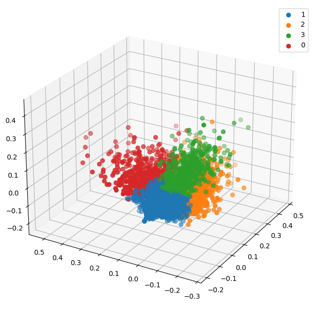
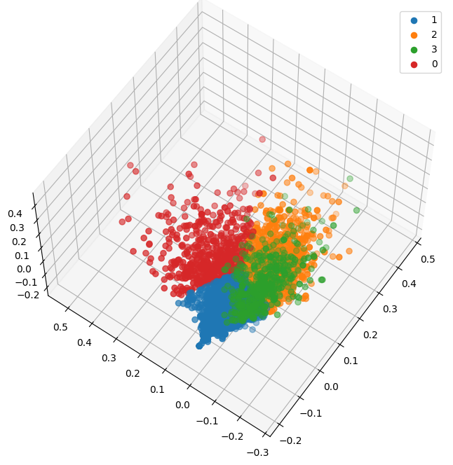
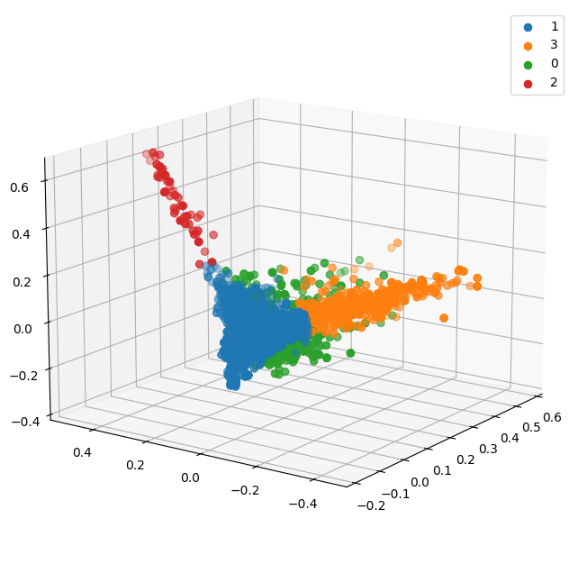
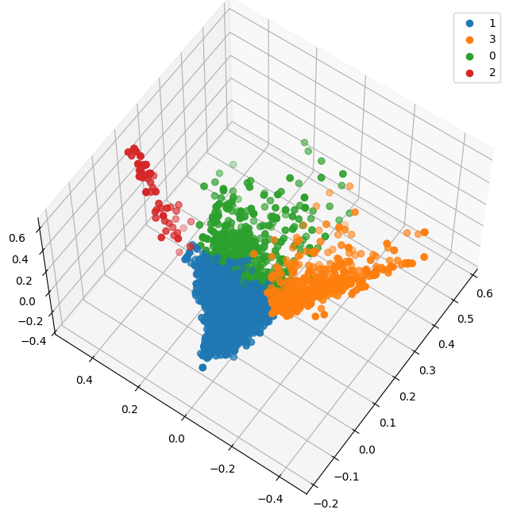
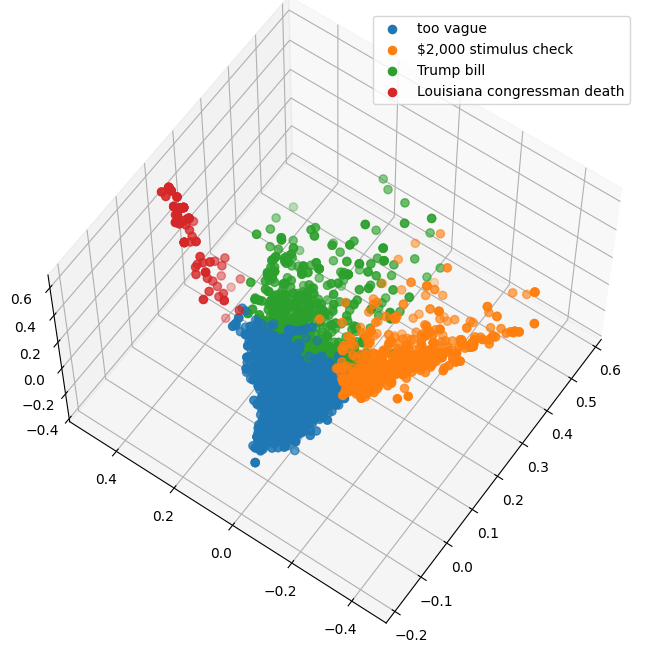

Pavel, Thames, James
# Project 3: Community learning

In this project, we scraped comments and posts from the politics subreddit during the 2020 elections using Pushshift API and attempted to find relevant clusters.

# Vizualisation 

## Comments cluster

## Posts cluster

## With labels
